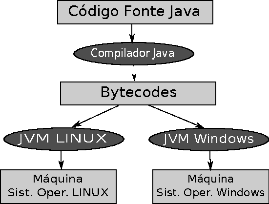

>❝ Sempre desejei que o meu computador fosse tão fácil de usar como o meu telefone. O meu desejo realizou-se. Já não sei usar o meu telefone ❞
> 
<b>Bjarne Stroustrup</b>, criador da linguagem C
 

Orientação à objetos é um paradigma de programação, isto é, uma forma ou estilo de programar. Basicamente, este modelo de programação utiliza o conceito de objetos para agrupar as informações e operações de entidades abstratas objetivando a solução de problemas. Assim, dizemos que uma linguagem é orientada a objetos quando ela disponibiliza recursos linguísticos que favorecem a implementação de programas usando este estilo de programação. Com isso, podemos de certa forma tratar as linguagens como ferramentas de implementação deste modelo de programação, sendo algumas delas mais apropriadas para a construção de programas neste estilo, e outras menos. 

Este material está inserido em um contexto no qual os alunos estão aprendendo algoritmos e programação por meio da Unidade Curricular denominada <b>Programação de soluções computacionais</b> que introduz os aspectos fundamentais de implementação de programas  sendo utilizado a linguagem Java como ferramenta de implementação dos conceitos de Orientação a Objetos.

Assim, se faz necessário apresentar alguns detalhes e pricípios básicos da linguagem antes de aprender o novo paradigma. 

Este texto apresenta um breve resumo da sintaxe, tipos de dados, operadores, comandos básicos, estruturas linguísticas, convenções de código e características tecnológicas oferecidas pela Linguagem de programação Java. 

### Conceito de Máquina Virtual Java

Algumas linguagens de programação, como por exemplo, C e Rust, compilam seus programas fontes para uma plataforma e um sistema operacional específico. O código binário gerado pela compilação é então executado pelo sistema operacional nativo para qual ele foi compilado. Isto é, este código executável poderá ser apenas executado neste sistema operacional. Para que o mesmo programa funcione em outro sistema operacional é necessário compilar o código fonte novamente utilizando um compilador adequado para este novo sistema
em questão.

O Java adota um conceito de máquina virtual que adiciona uma camada extra entre o sistema operacional e a aplicação. Esta camada é responsável por executar o código Java compilado, interpretando os comandos em chamadas do sistema operacional no qual está rodando no momento. A Máquina Virtual Java ou <b>Java Virtual Machine (JVM)</b> é responsável pela interpretação dos <b>bytecodes</b>. 

> **Bytecode** é o termo dado ao código binário gerado pelo compilador Java.

A Figura 1.1 descreve o conceito geral da Máquina Virtual Java. Um código de programa fonte em Java é compilado para bytecodes e podendo ser executado por máquinas virtuais Java específicas para diferentes plataformas. 

    

Figura 1.1. Conceito geral da Máquina Virtual Java.

### Plataforma de Desenvolvimento Java

O processo de criação de aplicações ou programas na linguagem Java passa pela edição do código fonte, compilação para bytecodes e execução pela máquina virtual Java. A edição do código fonte pode ser feita por meio de um editor de texto simples. Entretanto, existem ferramentas que facilitam o desenvolvimento de aplicações Java. Estas ferramentas também são conhecidas como IDE (<b>Integrated Development Environment</b>), ou seja, um Ambiente de Desenvolvimento Integrado. Estes ambientes disponibilizam uma série de recursos para dar produtividade. Dois exemplos interessantes de IDE são: <a href="https://www.netbeans.org">NetBeans</a>, <a href="https://www.eclipse.org">Eclipse</a> e <a href="https://code.visualstudio.com/">VSCode</a>.

O JDK é ambiente de desenvolvimento da linguagem Java, contendo o conjunto de ferramentas para compilar, depurar, executar e documentar um programa escrito em Java. O procedimento de instalação geralmente é simples, executando o arquivo e seguindo os passos, escolhendo o diretório desejado. Após a instalação, é necessário configurar  algumas   variáveis   de  ambiente no sistema operacional. Basicamente são duas variáveis importantes que o Java necessita que você adicione: <b>JAVA\HOME</b> e <b>CLASSPATH</b>.

O Java utiliza a variável de ambiente chamada <b>CLASSPATH</b> para procurar pelas classes e pacotes sempre que for necessário pelos programas. A variável <b>JAVA\HOME</b> torna possível executar o compilador Java e a máquina virtual de qualquer diretório. 

A compilação do código fonte será realizada pelo comando <b>javac</b> seguido do nome do arquivo (<b>.java</b>) para que o compilador do Java gere o bytecode correspondente. O bytecode gerado estará nos arquivos contidos no diretório atual com a extensão (<b> .class</b>) e o mesmo nome da sua classe Java compilada. A execução do bytecode será por meio do comando <b>java</b> seguido do nome da classe, invocando a máquina virtual para interpretar o seu programa.

